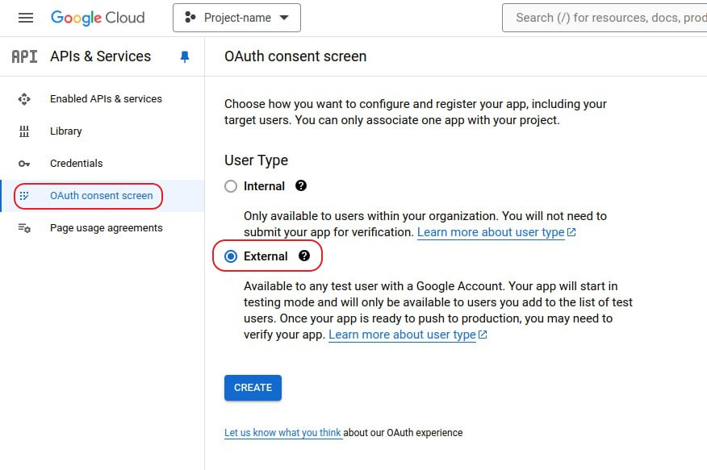

# Deploy

## build
```bash
docker build -t drive_reader .
```

## run
```bash
docker run -it --rm --env-file .env drive_reader streamlit run app.py --server.port=8000 --server.address=0.0.0.0
```

<br>

# Prepare Google API

1. Navigate to [**Google Conscole**](https://console.cloud.google.com/) and click on **API & Services**
 
2. Crate new project or open existing one 


3.  Enable Drive API


4. Set up consent screen




## Set up Scopes


### Choode "auth/drive"  


4. Create Service Accaoun


Leave everything to default

5. Create access key


6. Add content of **.json** key to **.env** file as `API_SECRET_KEY` var

<br>

# Usage

1. Copy service account email


2. Share folder with service account


# Update Kanban states

KANBAN_STATES in app/parser.py stores string values ​​describing states in Google Sheets. Update it if the Kanban states have been updated. Order doesn't matter.

VIEW_STATES in app/parser.py stores string values describing what needs to be displayed in a dashboard cell. Order matters. "Total" is necessary.
